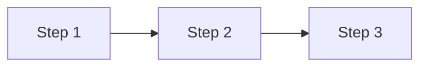

# Contributing

Thank you for your interest in contributing to the Product Builders HQ Frameworks repository.

## Overview

This repository contains formal definitions of software development frameworks, maturity models, and methodologies. Contributions should maintain consistency with existing patterns and follow the guidelines below.

## Types of Contributions

### 1. Framework Definitions

Adding or updating framework JSON definitions in the `frameworks/` directory.

### 2. Documentation

Improving documentation in the `docs/` directory.

### 3. Go Module

Enhancing the Go API for framework access.

### 4. Bug Fixes

Fixing issues in existing framework definitions or code.

## Framework Structure

Each framework should follow this structure:

```
frameworks/<framework-id>/
├── <framework-id>.json       # PRISM-compatible framework definition
├── <framework-id>.pidl.json  # Optional PIDL process spec
└── README.md                 # Framework overview
```

### JSON Schema

Framework definitions should reference the schema:

```json
{
  "$schema": "../../schema/framework.schema.json",
  "framework": "FRAMEWORK_ID",
  "name": "Human Readable Name",
  "description": "Framework description",
  "version": "1.0.0",
  "category": "maturity-model|metrics|methodology"
}
```

### Required Fields

| Field | Description |
|-------|-------------|
| `framework` | Unique identifier (uppercase, underscores) |
| `name` | Human-readable name |
| `description` | Brief description |
| `version` | Semantic version |
| `category` | Framework category |

### Common Categories

- `maturity-model` - Level-based progression frameworks (ASDM, PBMM)
- `metrics` - Measurement frameworks (AI-DORA, AI-SPACE)
- `methodology` - Process methodologies (AIDLC)
- `developer-productivity` - Developer productivity frameworks

## Go Module Guidelines

### Adding a New Framework

1. Define types in `types.go`:

```go
type NewFramework struct {
    Schema      string `json:"$schema,omitempty"`
    Framework   string `json:"framework,omitempty"`
    Name        string `json:"name,omitempty"`
    Description string `json:"description,omitempty"`
    Version     string `json:"version,omitempty"`
    // Framework-specific fields
}
```

2. Add embed directive in `embed.go`:

```go
//go:embed frameworks/new-framework/new-framework.json
var newFrameworkJSON []byte

var (
    newFrameworkOnce   sync.Once
    newFrameworkCached *NewFramework
)

func NewFramework() (*NewFramework, error) {
    var f NewFramework
    if err := json.Unmarshal(newFrameworkJSON, &f); err != nil {
        return nil, err
    }
    return &f, nil
}

func MustNewFramework() *NewFramework {
    newFrameworkOnce.Do(func() {
        f, err := NewFramework()
        if err != nil {
            panic(err)
        }
        newFrameworkCached = f
    })
    return newFrameworkCached
}

func NewFrameworkJSON() []byte {
    return newFrameworkJSON
}
```

3. Add tests in `embed_test.go`:

```go
func TestNewFramework(t *testing.T) {
    f, err := NewFramework()
    if err != nil {
        t.Fatalf("NewFramework() error = %v", err)
    }
    if f.Framework != "NEW_FRAMEWORK" {
        t.Errorf("Framework = %v, want NEW_FRAMEWORK", f.Framework)
    }
    // Additional assertions
}
```

## Documentation Guidelines

### MkDocs Pages

Documentation pages should include:

1. **Title** - Clear, descriptive heading
2. **Overview** - Brief introduction
3. **Content** - Framework details with tables and diagrams
4. **Usage** - Go API examples
5. **References** - Links to sources

### Mermaid Diagrams

Use Mermaid for diagrams:

```markdown

```

### Tables

Use tables for structured data:

```markdown
| Level | Name | Description |
|-------|------|-------------|
| 1 | Basic | Starting point |
| 2 | Intermediate | Some progress |
| 3 | Advanced | High capability |
```

## Development Workflow

### Prerequisites

- Go 1.21+
- Python 3.8+ (for MkDocs)
- Node.js 18+ (optional, for linting)

### Setup

```bash
# Clone repository
git clone https://github.com/ProductBuildersHQ/productbuildershq-frameworks.git
cd productbuildershq-frameworks

# Install MkDocs dependencies
pip install mkdocs mkdocs-material mkdocs-mermaid2-plugin

# Verify Go module
go mod tidy
go test ./...
```

### Testing

```bash
# Run Go tests
go test -v ./...

# Run linter
golangci-lint run

# Serve documentation locally
mkdocs serve
```

### Building Documentation

```bash
mkdocs build
```

## Pull Request Process

1. **Fork** the repository
2. **Create** a feature branch (`git checkout -b feature/new-framework`)
3. **Make** your changes
4. **Test** your changes (`go test ./...`)
5. **Commit** with conventional commit message
6. **Push** to your fork
7. **Open** a pull request

### Commit Messages

Follow [Conventional Commits](https://www.conventionalcommits.org/):

```
feat(aidlc): add security review deliverable

fix(ai-dora): correct MTTR threshold values

docs: add PBMM assessment guide

chore: update dependencies
```

## Code of Conduct

- Be respectful and inclusive
- Focus on constructive feedback
- Help maintain a welcoming community

## Questions?

Open an issue for questions or discussions about contributions.

## License

By contributing, you agree that your contributions will be licensed under the project's license.
