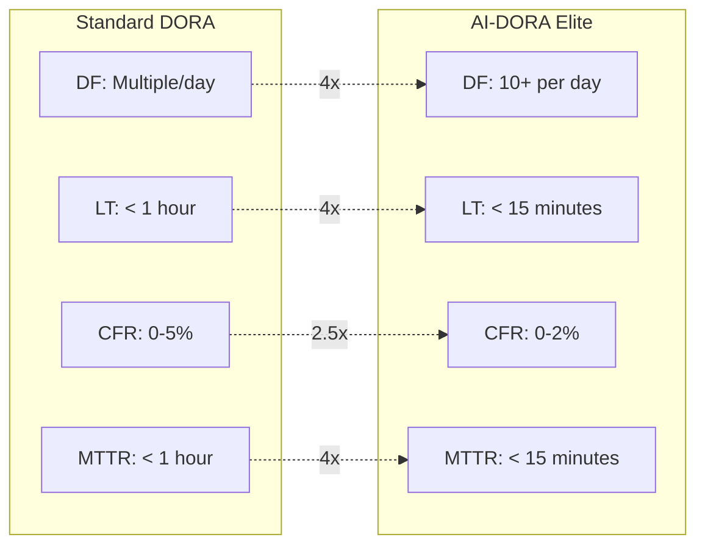

# AI-DORA - AI-Modified DORA Metrics

AI-DORA adapts the [DORA metrics](https://dora.dev) for AI-assisted software development, providing accelerated thresholds and AI enablers for each metric.

## Overview

DORA (DevOps Research and Assessment) provides four key metrics for measuring software delivery performance. AI-DORA modifies these metrics to reflect AI-accelerated delivery capabilities.

## Metrics

### Deployment Frequency (DF)

How often code is deployed to production.

| Level | Standard DORA | AI-DORA |
|-------|---------------|---------|
| Elite | On-demand (multiple/day) | On-demand (10+ per day) |
| High | Weekly to monthly | Daily |
| Medium | Monthly to quarterly | Weekly |
| Low | Less than quarterly | Less than weekly |

**AI Enablers:**

- Automated testing and validation
- AI-generated release notes
- Intelligent deployment scheduling
- Automated rollback decisions

---

### Lead Time for Changes (LT)

Time from code commit to production deployment.

| Level | Standard DORA | AI-DORA |
|-------|---------------|---------|
| Elite | Less than 1 hour | Less than 15 minutes |
| High | 1 day to 1 week | 1-4 hours |
| Medium | 1 week to 1 month | 1-7 days |
| Low | More than 1 month | More than 1 week |

**AI Enablers:**

- AI code review and approval
- Automated security scanning
- AI-assisted testing
- Intelligent CI/CD optimization

---

### Change Failure Rate (CFR)

Percentage of deployments causing production failures.

| Level | Standard DORA | AI-DORA |
|-------|---------------|---------|
| Elite | 0-5% | 0-2% |
| High | 5-10% | 2-5% |
| Medium | 10-15% | 5-10% |
| Low | 15%+ | 10%+ |

**AI Enablers:**

- Predictive failure analysis
- AI-powered testing coverage
- Intelligent canary deployments
- Automated quality gates

---

### Mean Time to Recovery (MTTR)

Time to restore service after an incident.

| Level | Standard DORA | AI-DORA |
|-------|---------------|---------|
| Elite | Less than 1 hour | Less than 15 minutes |
| High | Less than 1 day | Less than 1 hour |
| Medium | 1 day to 1 week | 1-4 hours |
| Low | More than 1 week | More than 4 hours |

**AI Enablers:**

- AI-assisted incident diagnosis
- Automated remediation playbooks
- Predictive alerting
- Intelligent rollback systems

## Performance Comparison



## Usage

### Go API

```go
import frameworks "github.com/ProductBuildersHQ/productbuildershq-frameworks"

aidora := frameworks.MustAIDora()

for _, metric := range aidora.Metrics {
    fmt.Printf("\n%s (%s)\n", metric.Name, metric.ID)
    fmt.Printf("  Direction: %s\n", metric.Direction)
    fmt.Printf("  Unit: %s\n", metric.Unit)
    fmt.Printf("  Elite threshold: %v\n", metric.Levels.Elite.Threshold)

    if len(metric.AIEnablers) > 0 {
        fmt.Println("  AI Enablers:")
        for _, enabler := range metric.AIEnablers {
            fmt.Printf("    - %s\n", enabler)
        }
    }
}
```

### Assessment

To assess your team against AI-DORA:

1. **Measure current metrics** using your CI/CD and monitoring tools
2. **Compare against thresholds** for each metric
3. **Identify AI enablers** that could improve performance
4. **Set targets** for improvement

### PRISM Integration

Use AI-DORA with PRISM for continuous tracking:

```json
{
  "id": "lead-time",
  "frameworkMappings": [
    {"framework": "DORA", "reference": "LT"},
    {"framework": "AI_DORA", "reference": "LT"}
  ]
}
```

## Relationship to AI-SPACE

AI-DORA focuses on **delivery performance** while [AI-SPACE](../ai-space/index.md) measures **developer productivity**. Use both for a complete picture:

| AI-DORA | Measures | AI-SPACE | Measures |
|---------|----------|----------|----------|
| Deployment Frequency | Delivery speed | Activity | Code output |
| Lead Time | Process efficiency | Efficiency | Flow state |
| Change Failure Rate | Quality | Satisfaction | Developer happiness |
| MTTR | Operational resilience | Communication | Collaboration |

## References

- [DORA Research](https://dora.dev)
- [DORA Metrics Overview](https://cloud.google.com/blog/products/devops-sre/using-the-four-keys-to-measure-your-devops-performance)
- [AI-DORA Article](https://productbuildershq.com/frameworks/dora-space-ai-age)
