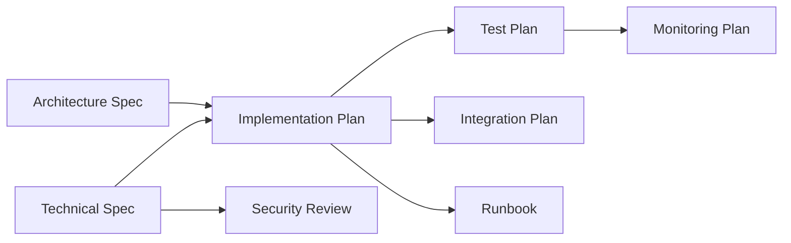

# Construction Phase

The Construction phase prepares for development execution through detailed implementation planning and quality assurance.

## Purpose

- Create detailed implementation plans with milestones and resource allocation
- Define comprehensive test strategies and automation approaches
- Plan system integrations with external services
- Conduct security analysis and threat modeling

## Deliverables

### Implementation Plan (Required)

Detailed implementation plan with milestones, task breakdown, and resource allocation.

**Inputs:**

- Approved Technical Specification
- Approved Architecture Specification
- API specifications
- Team capacity and skill matrix
- Sprint configuration and timeline constraints

**Outputs:**

- Implementation Plan (Markdown)
- Structured task backlog for project management
- Milestone timeline with dependencies

**Evaluation Criteria:**

| Category | Weight | Description |
|----------|--------|-------------|
| Completeness | 30% | All components covered with clear ownership and dependencies |
| Feasibility | 25% | Timeline realistic given team capacity and dependencies |
| Risk Assessment | 25% | Risks identified with probability, impact, and mitigation |
| Timeline | 20% | Clear milestones with measurable deliverables |

---

### Test Plan (Required)

Comprehensive test plan including test strategy, test cases, and automation approach.

**Inputs:**

- Approved Implementation Plan
- Requirements Specification for test coverage mapping
- Requirements matrix for traceability
- Available test infrastructure and tools

**Outputs:**

- Test Plan (Markdown)
- Structured test cases with requirements traceability
- Test data generation requirements

**Evaluation Criteria:**

| Category | Weight | Description |
|----------|--------|-------------|
| Coverage | 25% | Test cases map to all requirements with clear traceability |
| Edge Cases | 20% | Edge cases, boundary conditions, and error scenarios documented |
| Automation Readiness | 20% | Clear automation strategy with tools and CI/CD integration |
| Test Data | 15% | Test data requirements defined with generation strategy |
| Environments | 20% | Test environments clearly defined with setup procedures |

---

### Integration Plan (Optional)

Integration plan for connecting with external systems and services.

**Inputs:**

- Approved Implementation Plan
- Technical Specification with API contracts
- API specifications for integration
- External system documentation and credentials

**Outputs:**

- Integration Plan (Markdown)
- System integration matrix
- API gateway configuration

**Evaluation Criteria:**

| Category | Weight | Description |
|----------|--------|-------------|
| Completeness | 35% | All integration points identified with protocols and data formats |
| Compatibility | 35% | Version compatibility verified with fallback strategies |
| Rollout Strategy | 30% | Phased rollout with rollback procedures |

---

### Security Review (Required)

Security analysis including threat modeling, access control, and compliance requirements.

**Inputs:**

- Technical Specification for security analysis
- Architecture Specification for attack surface analysis
- API specifications for authentication review
- Applicable compliance frameworks (SOC2, GDPR, HIPAA, etc.)
- Data classification and sensitivity levels

**Outputs:**

- Security Review (Markdown)
- STRIDE threat model
- Required security controls and mitigations
- Compliance requirements mapping

**Evaluation Criteria (Strict):**

| Category | Weight | Description |
|----------|--------|-------------|
| Threat Modeling | 25% | Comprehensive threat model with attack vectors and mitigations |
| Access Control | 25% | Authentication/authorization with least privilege and audit trails |
| Data Protection | 20% | Data classification, encryption, and key management documented |
| Compliance | 15% | Applicable compliance requirements with controls mapped |
| Incident Response | 15% | Incident response plan with detection and remediation |

!!! warning "Strict Pass Criteria"
    Security Review uses **strict pass criteria** requiring minimum weighted score of 85% and no critical/high issues.

## Phase Gate

### Construction Review

**Type:** Human review and approval

**Reviewers:** Engineering Lead, QA Lead, Security Team, Project Manager

**Criteria:**

- [ ] All required deliverables complete
- [ ] Implementation plan is feasible and resourced
- [ ] Test coverage meets quality standards
- [ ] Security review has no unmitigated critical risks
- [ ] Integration points validated

**Outcomes:**

| Decision | Action |
|----------|--------|
| **Approved** | Proceed to Operations phase |
| **Revision Required** | Address feedback and resubmit |
| **Rejected** | Fundamental issues require significant rework |

## Dependency Graph

## Cost Estimates

| Document | Input Tokens | Output Tokens | Est. Cost |
|----------|--------------|---------------|-----------|
| Implementation Plan | 15,000 | 8,000 | $0.17 |
| Test Plan | 12,000 | 10,000 | $0.19 |
| Integration Plan | 10,000 | 6,000 | $0.12 |
| Security Review | 15,000 | 12,000 | $0.23 |
| **Phase Total** | **52,000** | **36,000** | **$0.70** |

## Best Practices

!!! tip "Involve QA Early"
    Quality engineers should review the Implementation Plan to ensure testability.

!!! tip "Security by Design"
    Address security concerns before they become architectural constraints.

!!! tip "Validate Integrations"
    Test external API connectivity in sandbox environments early.

!!! tip "Automate First"
    Design tests with automation in mind from the start.

!!! tip "Document Dependencies"
    External team dependencies should have clear SLAs and escalation paths.

!!! tip "Plan for Failure"
    Every integration should have a fallback or degradation strategy.

## Next Steps

After Construction Review approval:

1. Proceed to [Operations Phase](operations.md)
2. Begin Runbook generation
3. Start Monitoring Plan development
