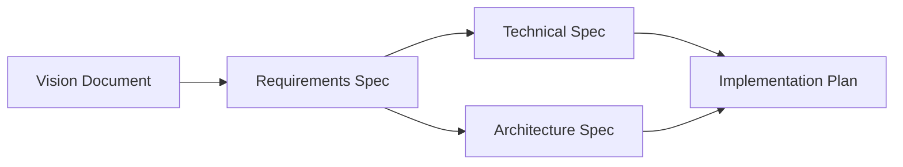

# Inception Phase

The Inception phase establishes the strategic foundation for the project through discovery and requirements definition.

## Purpose

- Define the product vision and strategic direction
- Capture functional and non-functional requirements
- Design technical architecture and system interfaces
- Establish success criteria and acceptance criteria

## Deliverables

### Vision Document (Required)

Strategic vision and product direction defining problem space, target users, and success criteria.

**Inputs:**

- Product brief or idea document
- Market analysis and competitive landscape
- Stakeholder interviews and feedback

**Outputs:**

- Vision Document (Markdown)
- Structured vision metadata for downstream documents

**Evaluation Criteria:**

| Category | Weight | Description |
|----------|--------|-------------|
| Clarity | 25% | Vision is clear, inspiring, and articulates a specific future state with measurable outcomes |
| Completeness | 25% | Document covers problem statement, target users, value proposition, and success criteria |
| Alignment | 25% | Clear stakeholder identification, documented input, and explicit alignment with goals |
| Feasibility | 25% | Feasibility addressed with clear constraints, risks, and mitigation strategies |

---

### Requirements Specification (Required)

Detailed functional and non-functional requirements with acceptance criteria.

**Inputs:**

- Approved Vision Document
- Structured vision metadata
- Domain-specific constraints and regulations

**Outputs:**

- Requirements Specification (Markdown)
- Structured requirements matrix for traceability

**Evaluation Criteria:**

| Category | Weight | Description |
|----------|--------|-------------|
| Coverage | 25% | All functional areas identified with comprehensive requirements |
| Clarity | 25% | Requirements are unambiguous, specific, and independently testable |
| Testability | 25% | Each requirement has clear acceptance criteria |
| Traceability | 25% | Requirements trace back to vision and forward to design |

---

### Technical Specification (Required)

Technical design including APIs, data models, and system interfaces.

**Inputs:**

- Approved Requirements Specification
- Requirements matrix for traceability
- Available technology options and constraints
- Existing API documentation for integration

**Outputs:**

- Technical Specification (Markdown)
- OpenAPI/AsyncAPI specifications
- JSON Schema definitions for data models

**Evaluation Criteria:**

| Category | Weight | Description |
|----------|--------|-------------|
| Architecture | 25% | Architecture follows established patterns and addresses scalability |
| Scalability | 20% | Scalability explicitly addressed with capacity planning |
| Implementation Clarity | 20% | APIs, data models, and interfaces clearly defined |
| Technology Choices | 20% | Technology choices documented with clear rationale |
| Dependencies | 15% | All dependencies documented with version requirements |

---

### Architecture Specification (Optional)

System architecture including component design, scalability, and deployment topology.

**Inputs:**

- Approved Requirements Specification
- Requirements matrix
- Cloud/infrastructure constraints and preferences
- Organization's architecture patterns catalog

**Outputs:**

- Architecture Specification (Markdown)
- C4 or similar component diagram data
- Infrastructure as Code templates

**Evaluation Criteria:**

| Category | Weight | Description |
|----------|--------|-------------|
| Component Design | 30% | Clear component boundaries, responsibilities, and interfaces |
| Scalability | 25% | Horizontal/vertical scaling strategies with capacity targets |
| Deployment | 25% | Complete deployment topology with environments |
| Security | 20% | Security boundaries, authentication, and data flow |

## Phase Gate

### Inception Review

**Type:** Human review and approval

**Reviewers:** Product Owner, Technical Lead, Architecture Review Board

**Criteria:**

- [ ] All required deliverables complete
- [ ] Vision aligned with organizational strategy
- [ ] Requirements are testable and traceable
- [ ] Technical design is feasible
- [ ] Risks identified and mitigation planned

**Outcomes:**

| Decision | Action |
|----------|--------|
| **Approved** | Proceed to Construction phase |
| **Revision Required** | Address feedback and resubmit |
| **Rejected** | Fundamental issues require significant rework |

## Dependency Graph

## Cost Estimates

| Document | Input Tokens | Output Tokens | Est. Cost |
|----------|--------------|---------------|-----------|
| Vision Document | 5,000 | 3,000 | $0.06 |
| Requirements Spec | 8,000 | 6,000 | $0.11 |
| Technical Spec | 12,000 | 10,000 | $0.19 |
| Architecture Spec | 10,000 | 8,000 | $0.15 |
| **Phase Total** | **35,000** | **27,000** | **$0.51** |

## Best Practices

!!! tip "Stakeholder Alignment"
    Ensure all stakeholders review and approve the Vision Document before proceeding to requirements.

!!! tip "Iterate on Requirements"
    Requirements will evolve; establish a change management process early.

!!! tip "Validate Technical Feasibility"
    Prototype critical technical decisions before committing to a design.

!!! tip "Document Assumptions"
    Explicitly state assumptions for future reference and validation.

!!! tip "Establish Traceability"
    Link requirements to vision and to downstream artifacts from the start.

## Next Steps

After Inception Review approval:

1. Proceed to [Construction Phase](construction.md)
2. Begin Implementation Plan generation
3. Start Test Plan development in parallel
