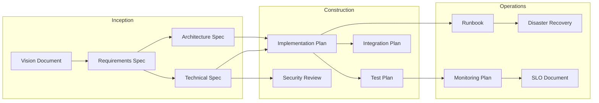
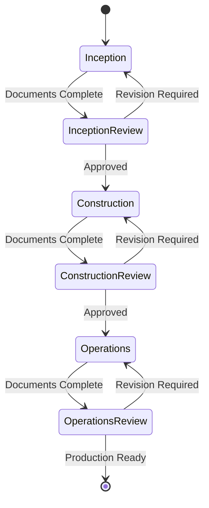

# AIDLC - AI-Driven Development Lifecycle

AWS AI-Driven Development Lifecycle (AIDLC) is a three-phase methodology for AI-native software development, adapted from the [AWS AI DLC](https://docs.aws.amazon.com/prescriptive-guidance/latest/ai-driven-software-development/).

## Overview

AIDLC structures AI-assisted software development into three phases, each with specific deliverables, human review gates, and quality evaluation criteria.



## Phases

| Phase | Purpose | Documents | Human Role |
|-------|---------|-----------|------------|
| [**Inception**](inception.md) | Discovery & Design | 4 | Strategic direction |
| [**Construction**](construction.md) | Planning & QA | 4 | Review & approval |
| [**Operations**](operations.md) | Production Readiness | 4 | Governance |

## Documents

### Inception Phase

| Document | Required | Description |
|----------|----------|-------------|
| Vision Document | Yes | Strategic vision, problem space, target users, success criteria |
| Requirements Specification | Yes | Functional/non-functional requirements, acceptance criteria |
| Technical Specification | Yes | APIs, data models, system interfaces |
| Architecture Specification | No | Component design, scalability, deployment topology |

### Construction Phase

| Document | Required | Description |
|----------|----------|-------------|
| Implementation Plan | Yes | Milestones, task breakdown, resource allocation |
| Test Plan | Yes | Test strategy, test cases, automation approach |
| Integration Plan | No | External system integration, rollout strategy |
| Security Review | Yes | Threat modeling, access control, compliance |

### Operations Phase

| Document | Required | Description |
|----------|----------|-------------|
| Runbook | Yes | Deployment procedures, troubleshooting, maintenance |
| Monitoring Plan | Yes | Metrics, alerts, dashboards |
| Disaster Recovery Plan | No | RTO/RPO targets, backup, failover procedures |
| SLO Document | Yes | SLIs, SLOs, error budgets, reporting |

## Human Review Gates

Each phase ends with a human review gate:



## Evaluation

AIDLC uses LLM-as-Judge evaluation with a 1-5 scoring scale:

| Score | Label | Description |
|-------|-------|-------------|
| 5 | Excellent | Exceeds all criteria |
| 4 | Good | Meets all criteria with minor gaps |
| 3 | Average | Meets basic criteria |
| 2 | Below Average | Significant gaps |
| 1 | Poor | Does not meet criteria |

### Pass Criteria

**Default (most documents):**

- Minimum weighted score: 70%
- Required category minimum: 3
- Maximum critical issues: 0
- Maximum high issues: 2

**Strict (Security Review):**

- Minimum weighted score: 85%
- Required category minimum: 4
- Maximum critical/high issues: 0

## Cost Estimates

Estimated LLM costs for generating all 12 documents:

| Metric | Value |
|--------|-------|
| Total Input Tokens | 127,000 |
| Total Output Tokens | 95,000 |
| Input Cost (at $0.003/1K) | $0.38 |
| Output Cost (at $0.015/1K) | $1.43 |
| **Total Estimated Cost** | **$1.81** |

### Per-Document Costs

| Document | Input Tokens | Output Tokens | Est. Cost |
|----------|--------------|---------------|-----------|
| Vision Document | 5,000 | 3,000 | $0.06 |
| Requirements Spec | 8,000 | 6,000 | $0.11 |
| Technical Spec | 12,000 | 10,000 | $0.19 |
| Architecture Spec | 10,000 | 8,000 | $0.15 |
| Implementation Plan | 15,000 | 8,000 | $0.17 |
| Test Plan | 12,000 | 10,000 | $0.19 |
| Integration Plan | 10,000 | 6,000 | $0.12 |
| Security Review | 15,000 | 12,000 | $0.23 |
| Runbook | 12,000 | 10,000 | $0.19 |
| Monitoring Plan | 10,000 | 8,000 | $0.15 |
| Disaster Recovery | 10,000 | 8,000 | $0.15 |
| SLO Document | 8,000 | 6,000 | $0.11 |

## Usage

### Go API

```go
import frameworks "github.com/ProductBuildersHQ/productbuildershq-frameworks"

aidlc := frameworks.MustAIDLC()

// List phases
for _, phase := range aidlc.Phases {
    fmt.Printf("%s: %d deliverables\n", phase.Name, len(phase.Deliverables))
}

// Get cost estimates
fmt.Printf("Estimated cost: $%.2f\n",
    aidlc.CostEstimates.Totals.EstimatedCostUSD)

// Check dependencies
for _, dep := range aidlc.Dependencies.Graph {
    fmt.Printf("%s → %s\n", dep.From, dep.To)
}
```

### PIDL Visualization

```bash
# Generate Mermaid diagram
pidl generate -f mermaid frameworks/aidlc/aidlc-workflow.pidl.json

# Generate SVG
pidl generate -f svg frameworks/aidlc/aidlc-workflow.pidl.json -o workflow.svg

# Security analysis
pidl analyze frameworks/aidlc/aidlc-workflow.pidl.json
```

### VisionSpec Integration

```bash
# Initialize project with AIDLC
visionspec init --methodology aidlc

# Sync AIDLC documents
visionspec aidlc sync
```

## Relationship to ASDM

AIDLC is the recommended methodology at **ASDM Level 4 (AI-Native Workflows)**:

| ASDM Level | Methodology | Human Role |
|------------|-------------|------------|
| Level 3 | AI-Assisted | Primary implementer |
| **Level 4** | **AIDLC** | **Orchestrator** |
| Level 5 | Agentic Engineering | Batch reviewer |

## Files

| File | Description |
|------|-------------|
| `aidlc-framework.json` | PRISM-compatible framework definition |
| `aidlc-workflow.pidl.json` | PIDL process specification |

## References

- [AWS AI-Driven Development Lifecycle](https://docs.aws.amazon.com/prescriptive-guidance/latest/ai-driven-software-development/)
- [AWS Project Mantle Case Study](https://productbuildershq.com/case-studies/aws-project-mantle)
- [ASDM Framework](../asdm/index.md)
