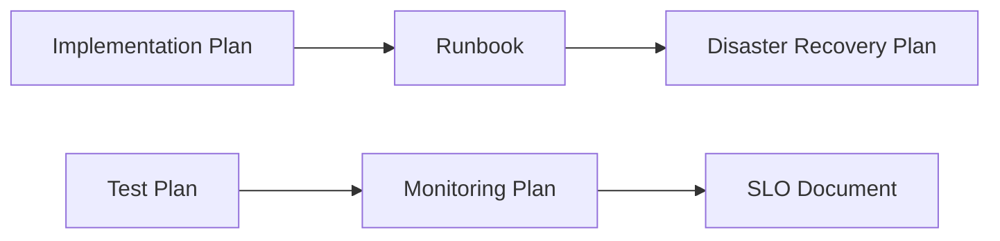

# Operations Phase

The Operations phase ensures production readiness through deployment procedures, monitoring, and reliability engineering.

## Purpose

- Create operational runbooks for deployment and maintenance
- Define monitoring and observability strategies
- Plan disaster recovery and business continuity
- Establish Service Level Objectives and error budgets

## Deliverables

### Runbook (Required)

Operational runbook with deployment procedures, troubleshooting guides, and maintenance tasks.

**Inputs:**

- Implementation Plan for deployment context
- Architecture Specification for infrastructure details
- Infrastructure as Code templates
- On-call procedures and escalation paths

**Outputs:**

- Runbook (Markdown)
- Pre/post deployment checklist
- Troubleshooting decision tree

**Evaluation Criteria:**

| Category | Weight | Description |
|----------|--------|-------------|
| Completeness | 30% | All operational scenarios covered with step-by-step procedures |
| Clarity | 25% | Procedures are unambiguous and can be followed by on-call engineer |
| Actionability | 25% | Each procedure has clear success criteria and verification steps |
| Rollback Procedures | 20% | Rollback procedures for every deployment step |

---

### Monitoring Plan (Required)

Monitoring and observability plan with metrics, alerts, and dashboards.

**Inputs:**

- Test Plan for quality metrics context
- Architecture Specification for component metrics
- Available monitoring tools (Prometheus, Datadog, etc.)
- Business KPIs to track

**Outputs:**

- Monitoring Plan (Markdown)
- Prometheus/OpenTelemetry metric definitions
- Alerting rules configuration
- Grafana/dashboard specifications

**Evaluation Criteria:**

| Category | Weight | Description |
|----------|--------|-------------|
| Coverage | 30% | All critical paths and components have metrics |
| Alert Quality | 25% | Alerts are actionable with clear thresholds and runbook links |
| Dashboard Design | 25% | Dashboards support incident triage and trend analysis |
| Integration | 20% | Monitoring integrates with alerting and on-call systems |

---

### Disaster Recovery Plan (Optional)

Disaster recovery plan with RTO/RPO targets, backup strategies, and failover procedures.

**Inputs:**

- Runbook for operational context
- Architecture Specification for infrastructure topology
- Infrastructure as Code templates
- Business continuity and availability requirements

**Outputs:**

- Disaster Recovery Plan (Markdown)
- Backup configuration and schedules
- Failover and recovery playbook

**Evaluation Criteria:**

| Category | Weight | Description |
|----------|--------|-------------|
| RTO/RPO | 30% | RTO/RPO targets defined and validated against business requirements |
| Backup Strategy | 25% | Backup procedures documented with retention policies and verification |
| Failover Procedures | 25% | Automated or documented manual failover for all critical components |
| Testing | 20% | DR testing schedule with success criteria |

---

### SLO Document (Required)

Service Level Objectives with SLIs, SLOs, error budgets, and reporting.

**Inputs:**

- Monitoring Plan for metrics foundation
- Requirements Specification for non-functional requirements
- Available metrics for SLI calculation
- Business SLA commitments

**Outputs:**

- SLO Document (Markdown)
- SLI calculation formulas and data sources
- Error budget policies and alerting
- SLO dashboard configuration

**Evaluation Criteria:**

| Category | Weight | Description |
|----------|--------|-------------|
| SLI Definition | 25% | SLIs clearly defined with measurement method and calculation formula |
| SLO Targets | 25% | SLO targets defined with specific percentages and time windows |
| Error Budgets | 20% | Error budgets defined with burn rate alerts and exhaustion policies |
| Stakeholder Alignment | 15% | Stakeholder sign-off documented with escalation procedures |
| Reporting | 15% | Reporting cadence, dashboard links, and review meeting schedule |

## Phase Gate

### Operations Review

**Type:** Human review and approval

**Reviewers:** SRE Lead, Operations Team, Product Owner, Security Team

**Criteria:**

- [ ] All required deliverables complete
- [ ] Runbooks tested by operations team
- [ ] Monitoring covers all critical paths
- [ ] SLOs aligned with business requirements
- [ ] DR plan tested or scheduled for testing

**Outcomes:**

| Decision | Action |
|----------|--------|
| **Approved** | Ready for production deployment |
| **Revision Required** | Address feedback and resubmit |
| **Rejected** | System not production-ready |

## Dependency Graph

## Cost Estimates

| Document | Input Tokens | Output Tokens | Est. Cost |
|----------|--------------|---------------|-----------|
| Runbook | 12,000 | 10,000 | $0.19 |
| Monitoring Plan | 10,000 | 8,000 | $0.15 |
| Disaster Recovery Plan | 10,000 | 8,000 | $0.15 |
| SLO Document | 8,000 | 6,000 | $0.11 |
| **Phase Total** | **40,000** | **32,000** | **$0.60** |

## Best Practices

!!! tip "Test Runbooks in Staging"
    Have on-call engineers execute procedures before production deployment.

!!! tip "Start with 4 Golden Signals"
    Latency, traffic, errors, and saturation cover most monitoring scenarios.

!!! tip "Avoid Alert Fatigue"
    Every alert should be actionable; tune thresholds based on data.

!!! tip "Practice DR Regularly"
    Schedule quarterly DR drills; document lessons learned.

!!! tip "Set Realistic SLOs"
    Start conservative; tighten after establishing baselines.

!!! tip "Link SLOs to Business Outcomes"
    Each SLO should map to user experience or business metric.

!!! tip "Automate Error Budget Tracking"
    Integrate with deployment pipelines to gate releases.

## SRE Integration

AIDLC Operations phase artifacts integrate with standard SRE practices:

| AIDLC Artifact | SRE Practice | Integration Point |
|----------------|--------------|-------------------|
| Runbook | Incident Response | On-call playbooks |
| Monitoring Plan | Observability | Metric definitions, dashboards |
| DR Plan | Reliability | Chaos engineering, game days |
| SLO Document | Service Level Management | Error budgets, release gates |

## Production Readiness Checklist

Before completing Operations phase, verify:

- [ ] Runbook procedures validated by operations team
- [ ] All critical alerts have runbook links
- [ ] Dashboards support incident triage
- [ ] Backup/restore tested and documented
- [ ] Failover tested (or scheduled)
- [ ] SLOs agreed upon by stakeholders
- [ ] Error budget alerting configured
- [ ] On-call rotation established
- [ ] Escalation paths documented
- [ ] Post-incident review process defined

## Completion

After Operations Review approval, the system is **production-ready**:

1. Deploy to production environment
2. Begin SLO tracking
3. Schedule first DR drill
4. Establish regular review cadence
