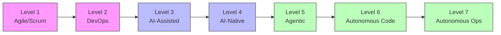
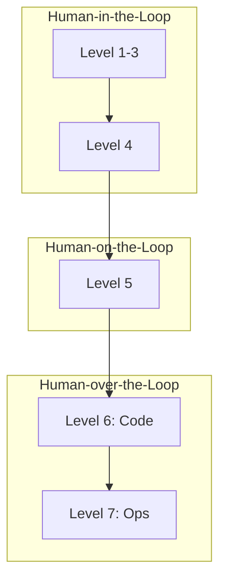

# ASDM - Autonomous Software Delivery Model

The Autonomous Software Delivery Model (ASDM) is a seven-level progression from traditional Agile teams to autonomous software delivery and operations.

## Overview

ASDM tracks an organization's journey toward AI-driven software delivery, measuring the degree of autonomy and the changing role of humans in the development process.



## Levels

### Level 1: Agile/Scrum

| Aspect | Description |
|--------|-------------|
| **Human Role** | Execute work |
| **Defining Characteristic** | Team coordination optimization |
| **Human Loop Position** | Human-in-the-loop (interactive, every step) |

**Practices:** Sprint planning, daily standup, sprint review, retrospective

**Artifacts:** User stories, sprint backlogs, retrospective notes

---

### Level 2: DevOps

| Aspect | Description |
|--------|-------------|
| **Human Role** | Build + operate |
| **Defining Characteristic** | Pipeline automation (CI/CD) |
| **Human Loop Position** | Human-in-the-loop (interactive, every step) |

**Practices:** CI/CD pipelines, Infrastructure as Code, Monitoring

**Artifacts:** Pipeline configurations, runbooks, SLO definitions

---

### Level 3: AI-Assisted

| Aspect | Description |
|--------|-------------|
| **Human Role** | Primary implementer |
| **Defining Characteristic** | AI augments existing process |
| **Human Loop Position** | Human-in-the-loop (interactive, every step) |

**Practices:** AI code completion, AI-assisted testing, AI documentation

**Artifacts:** Prompt templates, AI tool configurations

---

### Level 4: AI-Native Workflows

| Aspect | Description |
|--------|-------------|
| **Human Role** | Orchestrator |
| **Defining Characteristic** | Process redesigned around AI |
| **Human Loop Position** | Human-in-the-loop (but process is AI-native) |

**Practices:**

- Steering files (AGENTS.md) - *introduce*
- Governance-by-policy - *introduce*

**Artifacts:** Steering files, prompt libraries, context specs

**Examples:** AWS AI-Driven Development Lifecycle (AI-DLC)

!!! note "AIDLC Integration"
    [AIDLC](../aidlc/index.md) is the recommended methodology at Level 4.

---

### Level 5: Agentic Engineering

| Aspect | Description |
|--------|-------------|
| **Human Role** | Batch reviewer |
| **Defining Characteristic** | Extended autonomous sessions |
| **Human Loop Position** | Human-on-the-loop (batch review after autonomous sessions) |

**Practices:**

- Steering files (AGENTS.md) - *mature*
- Extended autonomous sessions - *core*
- Scenario-based validation - *partial*
- Digital Twin infrastructure - *experiment*
- Governance-by-policy - *develop*

**Artifacts:** Execution logs, batch review queues, agent traces

**Rituals:** Queue-before-sleep, morning review, high-bandwidth standups

**Examples:** AWS Project Mantle, Spotify Honk

---

### Level 6: Autonomous Coding & Review

| Aspect | Description |
|--------|-------------|
| **Human Role** | Specification owner |
| **Defining Characteristic** | No human coding or code review |
| **Human Loop Position** | Human-over-the-code-loop (humans define intent and scenarios, not code) |

**Practices:**

- Steering files (AGENTS.md) - *required*
- Extended autonomous sessions - *core*
- Scenario-based validation - *required*
- Digital Twin infrastructure - *required*
- Zero human code review - *required*
- Governance-by-policy - *required*
- Autonomous operations - *experiment*

**Artifacts:** Scenario libraries, Digital Twins, satisfaction dashboards

**Examples:** StrongDM Software Factory

---

### Level 7: Autonomous Operations

| Aspect | Description |
|--------|-------------|
| **Human Role** | Governor |
| **Defining Characteristic** | Autonomous production operations |
| **Human Loop Position** | Human-over-the-operations-loop (governance, incidents, and exceptions only) |

**Practices:**

- All Level 6 practices - *required*
- Autonomous operations - *required*

**Artifacts:** Operational policy engines, production guardrails, remediation playbooks

**Examples:** Emerging frontier (no public examples yet)

## Human Loop Evolution



| Position | Levels | Human Involvement |
|----------|--------|-------------------|
| Human-in-the-loop | 1-4 | Interactive, every step |
| Human-on-the-loop | 5 | Batch review after autonomous sessions |
| Human-over-the-code-loop | 6 | Define intent and scenarios, not code |
| Human-over-the-operations-loop | 7 | Governance, incidents, exceptions only |

## Case Studies

| Organization | Level | Date | Documentation |
|--------------|-------|------|---------------|
| AWS Project Mantle | 5 | 2026-01 | [Article](https://productbuildershq.com/case-studies/aws-project-mantle) |
| StrongDM Software Factory | 6 | 2026-02 | [Article](https://productbuildershq.com/case-studies/strongdm-software-factory) |

## Usage

### Go API

```go
import frameworks "github.com/ProductBuildersHQ/productbuildershq-frameworks"

asdm := frameworks.MustASDM()

// List all levels
for _, level := range asdm.Levels {
    fmt.Printf("Level %d: %s\n", level.Level, level.Name)
    fmt.Printf("  Human Role: %s\n", level.HumanRole)
    fmt.Printf("  Characteristic: %s\n", level.DefiningCharacteristic)
}

// Find practices at a specific level
level5 := asdm.Levels[4]
for _, practice := range level5.Practices {
    fmt.Printf("  %s (%s)\n", practice.Name, practice.Maturity)
}
```

### Assessment

Use ASDM to assess your current level:

1. Review practices at each level
2. Identify which practices are in place
3. Note the maturity of each practice
4. Determine highest level with all required practices

## References

- [Software Delivery Autonomy Article](https://productbuildershq.com/frameworks/software-delivery-autonomy)
- [AWS AI-Driven Development Lifecycle](https://docs.aws.amazon.com/prescriptive-guidance/latest/ai-driven-software-development/)
- [AWS Project Mantle Case Study](https://productbuildershq.com/case-studies/aws-project-mantle)
