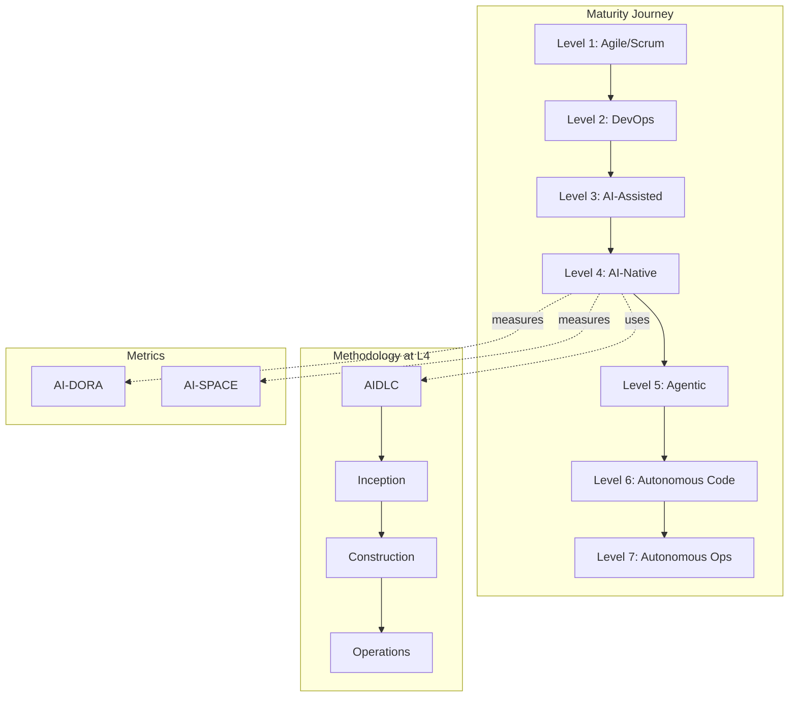

# Frameworks Overview

ProductBuildersHQ Frameworks provides machine-readable specifications for software development frameworks, organized into three categories.

## Framework Categories

### Development Lifecycles

Structured methodologies for AI-native software development.

| Framework | Type | Description |
|-----------|------|-------------|
| [**AIDLC**](aidlc/index.md) | Adapted | AWS AI-Driven Development Lifecycle with 3 phases and 12 document types |

### Maturity Models

Progressive capability models for team and organizational assessment.

| Framework | Type | Levels | Description |
|-----------|------|--------|-------------|
| [**ASDM**](asdm/index.md) | Original | 7 | Autonomous Software Delivery Model |
| [**PBMM**](pbmm/index.md) | Original | 7 | Product Builder Maturity Model (dual-path) |

### Metrics Frameworks

Measurement frameworks for AI-assisted development teams.

| Framework | Type | Based On | Metrics |
|-----------|------|----------|---------|
| [**AI-DORA**](ai-dora/index.md) | Adapted | DORA | 4 metrics |
| [**AI-SPACE**](ai-space/index.md) | Adapted | SPACE | 25 metrics (5 dimensions) |

## Framework Relationships

## Comparison Matrix

| Aspect | AIDLC | ASDM | PBMM | AI-DORA | AI-SPACE |
|--------|-------|------|------|---------|----------|
| **Purpose** | Workflow | Maturity | Maturity | Metrics | Metrics |
| **Category** | Lifecycle | Delivery | Skills | Performance | Productivity |
| **Focus** | AI document generation | Team autonomy | Individual growth | Delivery speed | Developer experience |
| **Structure** | 3 phases | 7 levels | 7 levels | 4 metrics | 5 dimensions |
| **Human Role** | Approval gates | Decreasing | Converging | Measurement | Measurement |
| **AI Role** | Document generation | Increasing | N/A | Accelerator | Augmentation |

## When to Use Each Framework

### AIDLC (AI-Driven Development Lifecycle)

Use AIDLC when:

- Starting a new AI-native development project
- Need structured document generation workflow
- Want quality gates between development phases
- Building at ASDM Level 4 or higher

!!! example "AIDLC Use Case"
    A team starting a new microservice uses AIDLC to generate Vision → Requirements → Technical Spec → Implementation Plan → Test Plan → Runbook with LLM assistance and human review gates.

### ASDM (Autonomous Software Delivery Model)

Use ASDM when:

- Assessing team's AI adoption maturity
- Planning roadmap for increased autonomy
- Benchmarking against industry practices
- Justifying AI tooling investments

!!! example "ASDM Use Case"
    An engineering director uses ASDM to assess that their team is at Level 3 (AI-Assisted) and creates a roadmap to reach Level 5 (Agentic Engineering) within 12 months.

### PBMM (Product Builder Maturity Model)

Use PBMM when:

- Developing individual contributor growth paths
- Creating career ladders for PM and Engineering
- Assessing product builder skills
- Planning training programs

!!! example "PBMM Use Case"
    A VP of Engineering uses PBMM to create dual career tracks where PMs and Engineers can progress independently until Level 5 convergence.

### AI-DORA

Use AI-DORA when:

- Measuring delivery performance with AI tools
- Benchmarking against industry standards
- Tracking deployment frequency and lead time
- Setting AI-accelerated performance targets

!!! example "AI-DORA Use Case"
    A DevOps team uses AI-DORA to track how AI-assisted code review reduces lead time from days to hours, achieving "Elite" performance.

### AI-SPACE

Use AI-SPACE when:

- Measuring developer productivity holistically
- Avoiding Goodhart's Law pitfalls
- Balancing output metrics with wellbeing
- Understanding AI impact on satisfaction

!!! example "AI-SPACE Use Case"
    An engineering manager uses AI-SPACE to ensure AI tools improve developer Satisfaction and Activity without negatively impacting Communication or Efficiency.

## Framework Evolution

All frameworks are versioned and evolve based on industry practices:

| Framework | Current Version | Last Updated | Status |
|-----------|-----------------|--------------|--------|
| AIDLC | 1.0.0 | 2025 | Active |
| ASDM | 1.0.0 | 2025 | Active |
| PBMM | 1.0.0 | 2025 | Active |
| AI-DORA | 1.0.0 | 2025 | Active |
| AI-SPACE | 1.1.0 | 2025 | Active |

## Getting Started

1. **Choose a framework** based on your use case above
2. **Install the Go module** or access raw JSON
3. **Integrate with tools** like PRISM, VisionSpec, or PIDL
4. **Customize** for your organization's needs

See [Installation](../getting-started/installation.md) for setup instructions.
