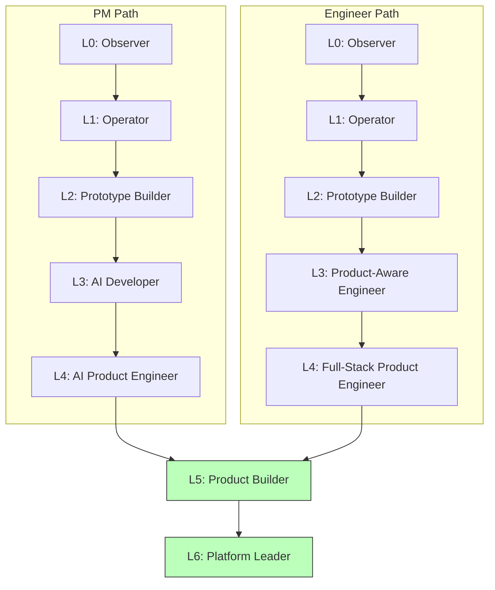

# PBMM - Product Builder Maturity Model

The Product Builder Maturity Model (PBMM) measures progress from traditional roles to AI-enabled product builders, with dual PM and Engineer paths that converge at higher levels.

## Overview

PBMM tracks the evolution of both product managers and engineers toward becoming full-stack "Product Builders" - individuals who can take ideas from concept to production autonomously using AI assistance.



## Levels

### Level 0: Observer

| Path | Description |
|------|-------------|
| PM | Uses AI for docs/brainstorming |
| Engineer | Uses AI for docs/brainstorming |

**Characteristics:**

- Passive AI consumption
- Basic prompt usage
- No workflow integration

---

### Level 1: Operator

| Path | Description |
|------|-------------|
| PM | Structured AI workflows |
| Engineer | Structured AI workflows |

**Characteristics:**

- Repeatable AI patterns
- Prompt libraries
- Task-specific workflows

---

### Level 2: Prototype Builder

| Path | Description |
|------|-------------|
| PM | Ships prototypes before engineering |
| Engineer | Ships prototypes before PM |

**Characteristics:**

- Rapid prototyping capability
- Cross-functional proactivity
- Reduced handoff dependencies

---

### Level 3: Technical Builder

| Path | Description |
|------|-------------|
| PM | AI Developer (writes code) |
| Engineer | Product-Aware Engineer |

**Characteristics:**

- Path-specific specialization
- PM: Production code capability
- Engineer: Customer empathy and product thinking

---

### Level 4: Production Engineer

| Path | Description |
|------|-------------|
| PM | AI Product Engineer |
| Engineer | Full-Stack Product Engineer |

**Characteristics:**

- Production-quality output
- System-level thinking
- Ownership mentality

---

### Level 5: Product Builder (Converged)

| Path | Description |
|------|-------------|
| Both | End-to-end ownership |

**Characteristics:**

- Idea to production autonomy
- Full-stack capability
- Business and technical fluency

---

### Level 6: Platform Leader (Converged)

| Path | Description |
|------|-------------|
| Both | Enables other builders |

**Characteristics:**

- Multiplier effect
- Platform thinking
- Organizational transformation

## Framework Mappings

PBMM metrics map to AI-DORA and AI-SPACE:

| PBMM Metric | AI-DORA | AI-SPACE |
|-------------|---------|----------|
| Features shipped without handoff | Deployment Frequency | Activity |
| Time to prototype | Lead Time | Efficiency |
| Production incidents on owned systems | Change Failure Rate | Performance |
| Mean time to resolution | MTTR | Efficiency |
| Prompt reuse rate | - | Activity |
| Stakeholder satisfaction | - | Satisfaction |

## Usage

### Go API

```go
import frameworks "github.com/ProductBuildersHQ/productbuildershq-frameworks"

pbmm := frameworks.MustPBMM()

// List all levels
for _, level := range pbmm.Levels {
    fmt.Printf("Level %d: %s\n", level.Level, level.Name)
    fmt.Printf("  PM Path: %s\n", level.PMPath)
    fmt.Printf("  Engineer Path: %s\n", level.EngineerPath)
    if level.Converged {
        fmt.Println("  [Paths converged]")
    }
}

// Check convergence point
fmt.Printf("Paths converge at Level %d\n", pbmm.Convergence.Level)
```

### Assessment

To assess individual or team maturity:

1. **Identify current path** (PM or Engineer background)
2. **Evaluate against level characteristics**
3. **Note path-specific behaviors** at each level
4. **Track progress** toward convergence
5. **Measure using framework mappings** (AI-DORA, AI-SPACE)

### Team Composition

For optimal team performance:

| Team Size | Recommended Composition |
|-----------|------------------------|
| 2-3 | 1+ L4-L5 Product Builder |
| 4-6 | 2+ L4-L5, rest L2-L3 |
| 7+ | L6 Platform Leader + mixed levels |

## Progression Strategies

### PM Path to Product Builder

1. **L0 → L1:** Develop structured prompt workflows
2. **L1 → L2:** Ship prototypes without engineering help
3. **L2 → L3:** Learn to write production code with AI
4. **L3 → L4:** Take ownership of production systems
5. **L4 → L5:** Achieve full end-to-end autonomy

### Engineer Path to Product Builder

1. **L0 → L1:** Develop structured prompt workflows
2. **L1 → L2:** Ship prototypes without waiting for PM
3. **L2 → L3:** Develop customer empathy and product thinking
4. **L3 → L4:** Own features from customer problem to solution
5. **L4 → L5:** Achieve full end-to-end autonomy

## References

- [Product Builder Maturity Model Article](https://productbuildershq.com/frameworks/product-builder-maturity-model)
- [AI-DORA](../ai-dora/index.md) - Delivery performance metrics
- [AI-SPACE](../ai-space/index.md) - Developer productivity metrics
