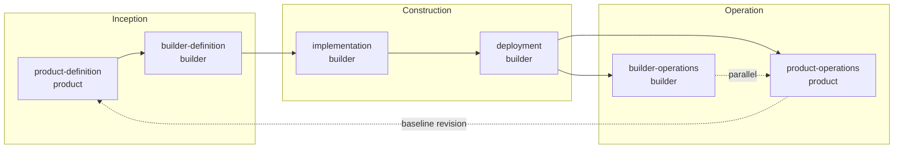

# PDLC - Product Development Lifecycle

PDLC (Product Development Lifecycle) is a six-stage development lifecycle spanning product definition through operations, native to ProductBuildersHQ. It is the **canonical stage-ID hub**: other lifecycle and posture frameworks (AIDLC, and consumer-owned overlays like Threat Model Spec's ASPM security-posture domains) map their stages onto PDLC's, so any two frameworks can be crosswalked through PDLC without a pairwise mapping.

## Overview

PDLC splits each of AWS AI-DLC's three phases into two parallel lenses — **product** and **builder** — so every stage has exactly one accountable role, while the two stages within a phase can proceed together rather than gating each other:



## Stages

| Stage | Role | AIDLC Phase | Gate |
|-------|------|--------------|------|
| [**Product Definition**](#1-product-definition-product-definition) | Product | Inception | Baseline Approval |
| [**Builder Definition**](#2-builder-definition-builder-definition) | Builder | Inception | Technical Design Review |
| [**Implementation**](#3-implementation-implementation) | Builder | Construction | Code Review / CI Gate |
| [**Deployment**](#4-deployment-deployment) | Builder | Construction | Release Gate |
| [**Builder Operations**](#5-builder-operations-builder-operations) | Builder | Operation | — |
| [**Product Operations**](#6-product-operations-product-operations) | Product | Operation | Baseline Revision Trigger |

### 1. Product Definition (`product-definition`)

Discovery through baseline handoff — the existing pdlc specification's seven detailed sub-stages: Discovery, Definition, Experience & Prototype, API, Documentation, Localization, Baseline & Handoff. Governed in full by the [pdlc repository](https://github.com/ProductBuildersHQ/pdlc); this framework entry references it rather than duplicating its normative content.

**Owner:** Product person. **Gate:** Baseline Approval (readiness report green, revision-pinned).

### 2. Builder Definition (`builder-definition`)

Consumes the approved Product Baseline and produces the authoritative technical design. Key deliverable pattern mirrors Product Definition's normative-spec-plus-advisory-evidence shape: the finalized **API Contract** (OpenAPI, refined from Product Definition's advisory draft) is normative, and a **Reference SDK Client** auto-generated from that contract is advisory — used for reference implementation and acceptance testing, proving the contract is implementable without itself being a requirement.

**Owner:** Builder person. **Gate:** Technical Design Review.

### 3. Implementation (`implementation`)

Code is written against the Builder Definition technical contract. Overlaid by Application Security Posture Management (ASPM) domains 1–5 (git posture, code security, secret/PII scan, open source security, SBOM) — the overlay is owned by consuming security-analysis tooling (e.g. Threat Model Spec), not by this framework.

**Owner:** Builder person. **Gate:** Code Review / CI Gate.

### 4. Deployment (`deployment`)

Built artifacts are released to target environments. Overlaid by ASPM domains 6–9 (IaC scan, CI/CD posture, container security, artifact security).

**Owner:** Builder person. **Gate:** Release Gate.

### 5. Builder Operations (`builder-operations`)

Infrastructure, security, and reliability operations for the deployed system: monitoring, incident response, cloud security posture. Overlaid by ASPM domain 10 (cloud context) plus dynamic testing (DAST, penetration testing, red teaming), which sits alongside ASPM rather than within it. **Runs concurrently with Product Operations**, not sequentially after it.

**Owner:** Builder person.

### 6. Product Operations (`product-operations`)

Adoption, usage, and feedback operations for the shipped product: activation, retention, feature usage, PMF signal, and customer feedback synthesis — closing the loop back into the next Product Definition baseline revision. **Runs concurrently with Builder Operations.**

**Owner:** Product person. **Gate:** Baseline Revision Trigger (on significant definition-vs-reality drift).

## Relationship to AIDLC

Every PDLC stage maps to exactly one AIDLC phase, and every AIDLC phase is claimed by exactly two PDLC stages:

| AIDLC Phase | PDLC Stages |
|-------------|-------------|
| Inception | Product Definition, Builder Definition |
| Construction | Implementation, Deployment |
| Operation | Builder Operations, Product Operations (parallel) |

The machine-readable crosswalk lives in `relatedFrameworks[0].stageMapping` in [`pdlc-framework.json`](https://github.com/ProductBuildersHQ/productbuildershq-frameworks/blob/main/frameworks/pdlc/pdlc-framework.json).

## Relationship to ASPM

Application Security Posture Management is not cataloged in this repository — it is security-domain-specific and owned by [Threat Model Spec](https://github.com/grokify/threat-model-spec), which maps its 10 ASPM domains onto the three builder-side stages here (Implementation, Deployment, Builder Operations). This keeps `productbuildershq-frameworks` scoped to general product/engineering-lifecycle frameworks.

## Usage

### Go API

```go
import frameworks "github.com/ProductBuildersHQ/productbuildershq-frameworks"

pdlc := frameworks.MustPDLC()

fmt.Printf("PDLC: %d phases\n", len(pdlc.Phases))
for _, p := range pdlc.Phases {
    fmt.Printf("  %s (%s, %s)\n", p.Name, p.Role, p.AIDLCPhase)
}

// Walk the phase dependency graph
for _, dep := range pdlc.Dependencies.Graph {
    fmt.Printf("%s -> %s\n", dep.From, dep.To)
}

// Walk the AIDLC crosswalk
for _, rel := range pdlc.RelatedFrameworks {
    for _, m := range rel.StageMapping {
        fmt.Printf("%s -> %v\n", m.From, m.To)
    }
}
```

## Files

| File | Purpose |
|------|---------|
| [`pdlc-framework.json`](https://github.com/ProductBuildersHQ/productbuildershq-frameworks/blob/main/frameworks/pdlc/pdlc-framework.json) | Framework definition: phases, deliverables, gates, dependency graph, AIDLC crosswalk |

A PIDL process model and per-phase deep-dive docs (mirroring [AIDLC's phase pages](../aidlc/index.md)) are a documented follow-up — the pdlc repository already owns a PIDL model for its Product Definition sub-stages (`model/pdlc-lifecycle.pidl.json`), and duplicating it here risks drift. This entry is intentionally the coarse six-stage catalog view; detailed sub-stage content stays normatively owned by the pdlc repository.

## References

- [PDLC Specification](https://github.com/ProductBuildersHQ/pdlc)
- [AWS AI-Driven Development Lifecycle](https://docs.aws.amazon.com/prescriptive-guidance/latest/ai-driven-software-development/)
- [AIDLC Framework](../aidlc/index.md)
