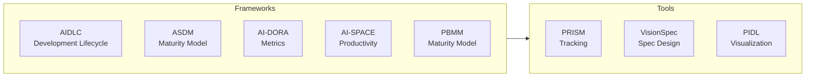
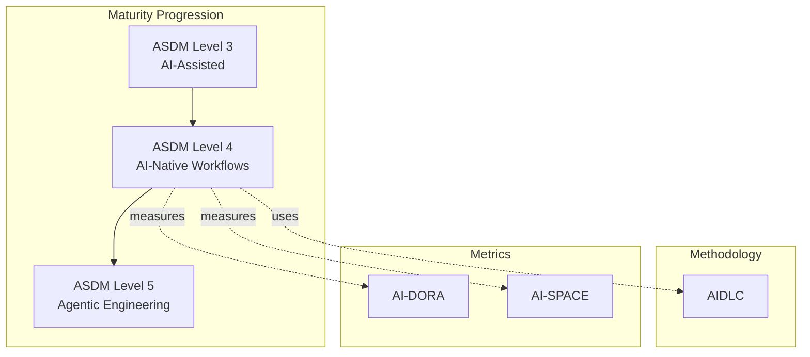

# ProductBuildersHQ Frameworks

Machine-readable specifications for maturity models, capability frameworks, and development lifecycles.

## Overview

This repository provides JSON specifications for software development frameworks that can be consumed programmatically by tools like [PRISM](https://github.com/grokify/prism), [VisionSpec](https://github.com/ProductBuildersHQ/visionspec), and [PIDL](https://github.com/grokify/pidl).



## Frameworks

### Development Lifecycles

| Framework | Description | Phases |
|-----------|-------------|--------|
| [**AIDLC**](frameworks/aidlc/index.md) | AWS AI-Driven Development Lifecycle | Inception → Construction → Operations |

### Maturity Models

| Framework | Description | Levels |
|-----------|-------------|--------|
| [**ASDM**](frameworks/asdm/index.md) | Autonomous Software Delivery Model | 7 levels (Agile → Autonomous Ops) |
| [**PBMM**](frameworks/pbmm/index.md) | Product Builder Maturity Model | 7 levels (dual-path convergence) |

### Metrics Frameworks

| Framework | Description | Based On |
|-----------|-------------|----------|
| [**AI-DORA**](frameworks/ai-dora/index.md) | AI-modified DORA metrics | [DORA](https://dora.dev) |
| [**AI-SPACE**](frameworks/ai-space/index.md) | AI-modified SPACE framework | [SPACE](https://queue.acm.org/detail.cfm?id=3454124) |

## Quick Start

### Go Module

```bash
go get github.com/ProductBuildersHQ/productbuildershq-frameworks
```

```go
package main

import (
    "fmt"
    frameworks "github.com/ProductBuildersHQ/productbuildershq-frameworks"
)

func main() {
    // Load AIDLC framework
    aidlc := frameworks.MustAIDLC()
    fmt.Printf("AIDLC: %d phases\n", len(aidlc.Phases))

    // Load ASDM framework
    asdm := frameworks.MustASDM()
    fmt.Printf("ASDM: %d levels\n", len(asdm.Levels))
}
```

### Raw JSON

All framework specifications are available as JSON files:

```
frameworks/
├── aidlc/
│   ├── aidlc-framework.json      # PRISM-compatible
│   └── aidlc-workflow.pidl.json  # PIDL visualization
├── asdm/
│   └── asdm.json
├── ai-dora/
│   └── ai-dora.json
├── ai-space/
│   └── ai-space.json
└── product-builder-maturity/
    └── product-builder-maturity.json
```

## Framework Relationships

The frameworks in this repository are interconnected:



- **AIDLC** is the recommended methodology at **ASDM Level 4** (AI-Native Workflows)
- **AI-DORA** and **AI-SPACE** provide metrics for measuring AI-assisted development
- **PBMM** tracks product builder skill progression across PM and Engineering paths

## Use Cases

### 1. Maturity Assessment

Use ASDM to assess your team's autonomous software delivery maturity:

```go
asdm := frameworks.MustASDM()
for _, level := range asdm.Levels {
    fmt.Printf("Level %d: %s - %s\n",
        level.Level, level.Name, level.DefiningCharacteristic)
}
```

### 2. Workflow Visualization

Use PIDL to visualize AIDLC workflows:

```bash
pidl generate -f mermaid frameworks/aidlc/aidlc-workflow.pidl.json
pidl generate -f svg frameworks/aidlc/aidlc-workflow.pidl.json -o workflow.svg
```

### 3. Metrics Tracking

Use AI-DORA and AI-SPACE with PRISM for metrics tracking:

```json
{
  "id": "lead-time",
  "frameworkMappings": [
    {"framework": "AI_DORA", "reference": "LT"},
    {"framework": "AI_SPACE", "reference": "E"}
  ]
}
```

## Documentation

- [Getting Started](getting-started/installation.md) - Installation and setup
- [Frameworks](frameworks/index.md) - Detailed framework documentation
- [API Reference](api/go-module.md) - Go module API
- [Integrations](integrations/prism.md) - Tool integrations

## License

Apache 2.0
