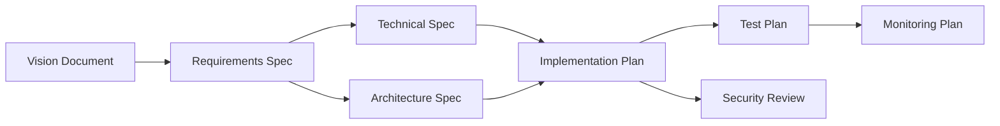

# VisionSpec Integration

[VisionSpec](https://github.com/ProductBuildersHQ/visionspec) is a specification authoring tool that uses frameworks from this repository for document generation and workflow management.

## Overview

VisionSpec integrates with:

- **AIDLC** - For implementation methodology and document generation
- **Requirements Methodologies** - For specification workflows (AWS Working Backwards, etc.)

## AIDLC Integration

VisionSpec uses AIDLC for AI-driven document generation workflows.

### Workflow Phases

```
Inception → Construction → Operations
```

Each phase generates specific deliverables:

| Phase | Deliverables |
|-------|--------------|
| Inception | Vision Document, Requirements Spec, Technical Spec, Architecture Spec |
| Construction | Implementation Plan, Test Plan, Integration Plan, Security Review |
| Operations | Runbook, Monitoring Plan, DR Plan, SLO Document |

### Document Dependencies

VisionSpec respects AIDLC document dependencies:



### Configuration

```yaml
# visionspec.yaml
project:
  name: my-project
  implementationMethodology: aidlc
  requirementsMethodology: aws-working-backwards/product

aidlc:
  phases:
    inception:
      deliverables:
        - vision-document
        - requirements-spec
        - technical-spec
    construction:
      deliverables:
        - implementation-plan
        - test-plan
        - security-review
    operations:
      deliverables:
        - runbook
        - monitoring-plan
        - slo-document
```

## Document Generation

VisionSpec uses AIDLC evaluation criteria for LLM-as-Judge document quality assessment.

### Evaluation Schema

```json
{
  "evaluation": {
    "schema": "v2",
    "scoringScale": {
      "min": 1,
      "max": 5,
      "passingThreshold": 3.5
    }
  }
}
```

### Per-Document Criteria

Each deliverable has weighted evaluation criteria:

```json
{
  "deliverable": "vision-document",
  "evaluationCriteria": [
    {"category": "Clarity", "weight": 25},
    {"category": "Completeness", "weight": 25},
    {"category": "Alignment", "weight": 25},
    {"category": "Feasibility", "weight": 25}
  ]
}
```

### Cost Estimation

VisionSpec displays AIDLC cost estimates:

```
Phase: Inception
  Vision Document:     ~$0.06
  Requirements Spec:   ~$0.11
  Technical Spec:      ~$0.19
  Architecture Spec:   ~$0.15
  ─────────────────────────────
  Phase Total:         ~$0.51
```

## Go API Integration

VisionSpec uses the Go module to access framework definitions:

```go
import (
    frameworks "github.com/ProductBuildersHQ/productbuildershq-frameworks"
)

// Get AIDLC framework
aidlc := frameworks.MustAIDLC()

// Access phase information
for _, phase := range aidlc.Phases {
    fmt.Printf("Phase: %s\n", phase.Name)
    for _, deliverable := range phase.Deliverables {
        fmt.Printf("  - %s\n", deliverable.Name)
    }
}

// Get cost estimates
fmt.Printf("Total cost: $%.2f\n", aidlc.CostEstimates.Totals.EstimatedCostUSD)
```

## UI Integration

VisionSpec displays AIDLC workflow status:

```
┌─────────────────────────────────────────────┐
│  AIDLC Workflow                             │
├─────────────────────────────────────────────┤
│  ● Inception      [████████████] 100%       │
│  ○ Construction   [████░░░░░░░░]  33%       │
│  ○ Operations     [░░░░░░░░░░░░]   0%       │
└─────────────────────────────────────────────┘
```

### Sidebar Menu

When AIDLC is selected as implementation methodology:

```
Project Name ▼
├── 📋 Requirements: AWS Working Backwards
├── 🔨 Implementation: AIDLC
├── ─────────────────
├── 🔄 AIDLC Workflow
├── 🔁 AIDLC Sync
├── ─────────────────
├── MRD ◐
├── PRD ○
└── ...
```

## Sync with Frameworks

VisionSpec can sync framework updates:

```bash
# Update to latest framework definitions
visionspec sync --frameworks

# Check framework version
visionspec info --framework aidlc
```

## Best Practices

1. **Select methodology early** - Choose implementation methodology when creating project
2. **Follow dependency order** - Generate documents in dependency order
3. **Review phase gates** - Complete phase gate reviews before proceeding
4. **Track costs** - Monitor LLM costs against AIDLC estimates
5. **Use evaluation criteria** - Apply LLM-as-Judge for quality assessment

## References

- [VisionSpec Documentation](https://visionspec.dev/docs)
- [VisionSpec Repository](https://github.com/ProductBuildersHQ/visionspec)
- [AIDLC Framework](../frameworks/aidlc/index.md)
