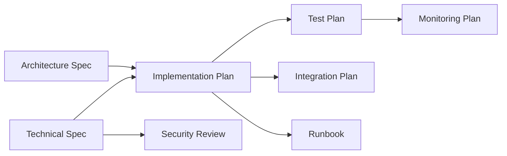

# Construction Phase

The Construction phase prepares for development execution through detailed implementation planning and quality assurance.

## Purpose

- Create detailed implementation plans with milestones and resource allocation
- Define comprehensive test strategies and automation approaches
- Plan system integrations with external services
- Conduct security analysis and threat modeling

## Deliverables

### Implementation Plan (Required)

**Description:** Detailed implementation plan with milestones, task breakdown, and resource allocation.

**Inputs:**
- Approved Technical Specification
- Approved Architecture Specification
- API specifications
- Team capacity and skill matrix
- Sprint configuration and timeline constraints

**Outputs:**
- Implementation Plan (Markdown)
- Structured task backlog for project management
- Milestone timeline with dependencies

**Evaluation Criteria:**

| Category | Weight | Pass | Partial | Fail |
|----------|--------|------|---------|------|
| Completeness | 30% | All components covered with clear ownership and dependencies | Most components covered but gaps exist | Significant components missing |
| Feasibility | 25% | Timeline realistic given team capacity and dependencies | Timeline aggressive but achievable | Timeline unrealistic |
| Risk Assessment | 25% | Risks identified with probability, impact, and mitigation | Some risks identified | No risk assessment |
| Timeline | 20% | Clear milestones with measurable deliverables | Milestones exist but unclear | No milestone structure |

### Test Plan (Required)

**Description:** Comprehensive test plan including test strategy, test cases, and automation approach.

**Inputs:**
- Approved Implementation Plan
- Requirements Specification for test coverage mapping
- Requirements matrix for traceability
- Available test infrastructure and tools

**Outputs:**
- Test Plan (Markdown)
- Structured test cases with requirements traceability
- Test data generation requirements

**Evaluation Criteria:**

| Category | Weight | Pass | Partial | Fail |
|----------|--------|------|---------|------|
| Coverage | 25% | Test cases map to all requirements with clear traceability and coverage targets defined | Some coverage exists but gaps in requirement mapping | Test coverage incomplete or no traceability |
| Edge Cases | 20% | Edge cases, boundary conditions, and error scenarios thoroughly documented with test cases | Some edge cases covered but not comprehensive | Edge cases not addressed |
| Automation Readiness | 20% | Clear automation strategy with tools, frameworks, and CI/CD integration plan | Automation mentioned but strategy incomplete | No automation plan included |
| Test Data | 15% | Test data requirements defined with generation strategy and data management plan | Some test data considerations present | Test data not addressed |
| Environments | 20% | Test environments clearly defined with setup procedures and environment parity requirements | Environments mentioned but incomplete details | Test environments not addressed |

### Integration Plan (Optional)

**Description:** Integration plan for connecting with external systems and services.

**Inputs:**
- Approved Implementation Plan
- Technical Specification with API contracts
- API specifications for integration
- External system documentation and credentials

**Outputs:**
- Integration Plan (Markdown)
- System integration matrix
- API gateway configuration

**Evaluation Criteria:**

| Category | Weight | Pass | Partial | Fail |
|----------|--------|------|---------|------|
| Completeness | 35% | All integration points identified with protocols and data formats | Most integrations covered | Integrations incomplete |
| Compatibility | 35% | Version compatibility verified with fallback strategies | Basic compatibility checked | Compatibility not verified |
| Rollout Strategy | 30% | Phased rollout with rollback procedures | Basic rollout plan | No rollout strategy |

### Security Review (Required)

**Description:** Security analysis including threat modeling, access control, and compliance requirements.

**Inputs:**
- Technical Specification for security analysis
- Architecture Specification for attack surface analysis
- API specifications for authentication review
- Applicable compliance frameworks (SOC2, GDPR, HIPAA, etc.)
- Data classification and sensitivity levels

**Outputs:**
- Security Review (Markdown)
- STRIDE threat model
- Required security controls and mitigations
- Compliance requirements mapping

**Evaluation Criteria (Strict):**

| Category | Weight | Pass | Partial | Fail |
|----------|--------|------|---------|------|
| Threat Modeling | 25% | Comprehensive threat model (STRIDE or similar) with attack vectors, risk ratings, and mitigations | Some threats identified but analysis incomplete | No threat modeling performed |
| Access Control | 25% | Authentication/authorization mechanisms documented with least privilege, role-based access, and audit trails | Access control mentioned but incomplete design | Access control not addressed |
| Data Protection | 20% | Data classification, encryption at rest/transit, and key management documented | Some data protection measures mentioned | Data protection not addressed |
| Compliance | 15% | Applicable compliance requirements identified (GDPR, SOC2, etc.) with controls mapped | Compliance mentioned but controls not mapped | Compliance requirements not addressed |
| Incident Response | 15% | Incident response plan with detection, escalation, and remediation procedures | Basic incident response considerations | Incident response not addressed |

> **Note:** Security Review uses **strict pass criteria** requiring minimum weighted score of 85% and no critical/high issues.

## Phase Gate

### Construction Review

**Type:** Human review and approval

**Reviewers:** Engineering Lead, QA Lead, Security Team, Project Manager

**Criteria:**
- All required deliverables complete
- Implementation plan is feasible and resourced
- Test coverage meets quality standards
- Security review has no unmitigated critical risks
- Integration points validated

**Outcome:**
- **Approved:** Proceed to Operations phase
- **Revision Required:** Address feedback and resubmit
- **Rejected:** Fundamental issues require significant rework

## Dependencies

## Estimated Effort

| Document | Input Tokens | Output Tokens | Est. Cost |
|----------|--------------|---------------|-----------|
| Implementation Plan | 15,000 | 8,000 | $0.17 |
| Test Plan | 12,000 | 10,000 | $0.19 |
| Integration Plan | 10,000 | 6,000 | $0.12 |
| Security Review | 15,000 | 12,000 | $0.23 |
| **Phase Total** | **52,000** | **36,000** | **$0.70** |

## Best Practices

1. **Involve QA early** - Quality engineers should review the Implementation Plan to ensure testability
2. **Security by design** - Address security concerns before they become architectural constraints
3. **Validate integrations** - Test external API connectivity in sandbox environments early
4. **Automate first** - Design tests with automation in mind from the start
5. **Document dependencies** - External team dependencies should have clear SLAs and escalation paths
6. **Plan for failure** - Every integration should have a fallback or degradation strategy
