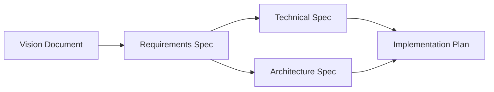

# Inception Phase

The Inception phase establishes the strategic foundation for the project through discovery and requirements definition.

## Purpose

- Define the product vision and strategic direction
- Capture functional and non-functional requirements
- Design technical architecture and system interfaces
- Establish success criteria and acceptance criteria

## Deliverables

### Vision Document (Required)

**Description:** Strategic vision and product direction defining problem space, target users, and success criteria.

**Inputs:**
- Product brief or idea document
- Market analysis and competitive landscape
- Stakeholder interviews and feedback

**Outputs:**
- Vision Document (Markdown)
- Structured vision metadata for downstream documents

**Evaluation Criteria:**

| Category | Weight | Pass | Partial | Fail |
|----------|--------|------|---------|------|
| Clarity | 25% | Vision is clear, inspiring, and articulates a specific future state with measurable outcomes | Vision exists but lacks specificity or measurable outcomes | Vision is missing, vague, or generic without clear direction |
| Completeness | 25% | Document covers problem statement, target users, value proposition, and success criteria comprehensively | Some required components present but gaps exist | Major components missing or incomplete |
| Alignment | 25% | Clear stakeholder identification, documented input, and explicit alignment with organizational goals | Stakeholders identified but limited evidence of alignment | No stakeholder alignment documented |
| Feasibility | 25% | Feasibility addressed with clear constraints, risks, and mitigation strategies | Basic feasibility mentioned but lacks depth | No feasibility assessment included |

### Requirements Specification (Required)

**Description:** Detailed functional and non-functional requirements with acceptance criteria.

**Inputs:**
- Approved Vision Document
- Structured vision metadata
- Domain-specific constraints and regulations

**Outputs:**
- Requirements Specification (Markdown)
- Structured requirements matrix for traceability

**Evaluation Criteria:**

| Category | Weight | Pass | Partial | Fail |
|----------|--------|------|---------|------|
| Coverage | 25% | All functional areas identified with comprehensive requirements | Most areas covered but some gaps | Significant functional areas missing |
| Clarity | 25% | Requirements are unambiguous, specific, and independently testable | Some ambiguity or overlap exists | Requirements are vague or contradictory |
| Testability | 25% | Each requirement has clear acceptance criteria | Some requirements lack testable criteria | Most requirements cannot be verified |
| Traceability | 25% | Requirements trace back to vision and forward to design | Partial traceability exists | No traceability established |

### Technical Specification (Required)

**Description:** Technical design including APIs, data models, and system interfaces.

**Inputs:**
- Approved Requirements Specification
- Requirements matrix for traceability
- Available technology options and constraints
- Existing API documentation for integration

**Outputs:**
- Technical Specification (Markdown)
- OpenAPI/AsyncAPI specifications
- JSON Schema definitions for data models

**Evaluation Criteria:**

| Category | Weight | Pass | Partial | Fail |
|----------|--------|------|---------|------|
| Architecture | 25% | Architecture follows established patterns, addresses scalability, and includes clear component interactions | Architecture exists but has gaps in design or scalability considerations | Architecture is missing or fundamentally flawed |
| Scalability | 20% | Scalability explicitly addressed with capacity planning, bottleneck analysis, and growth strategies | Some scalability considerations present but incomplete | No scalability considerations in design |
| Implementation Clarity | 20% | APIs, data models, and interfaces clearly defined with sufficient detail for implementation | Some technical details present but gaps exist | Insufficient detail for implementation |
| Technology Choices | 20% | Technology choices documented with clear rationale, alternatives considered, and trade-offs explained | Technologies mentioned but rationale incomplete | Technology choices not justified or inappropriate |
| Dependencies | 15% | All dependencies documented with version requirements, fallback strategies, and integration points | Dependencies listed but incomplete information | Dependencies not identified |

### Architecture Specification (Optional)

**Description:** System architecture including component design, scalability, and deployment topology.

**Inputs:**
- Approved Requirements Specification
- Requirements matrix
- Cloud/infrastructure constraints and preferences
- Organization's architecture patterns catalog

**Outputs:**
- Architecture Specification (Markdown)
- C4 or similar component diagram data
- Infrastructure as Code templates

**Evaluation Criteria:**

| Category | Weight | Pass | Partial | Fail |
|----------|--------|------|---------|------|
| Component Design | 30% | Clear component boundaries, responsibilities, and interfaces | Components defined but boundaries unclear | Component design missing or confused |
| Scalability | 25% | Horizontal/vertical scaling strategies with capacity targets | Basic scaling mentioned | No scaling strategy |
| Deployment | 25% | Complete deployment topology with environments | Partial deployment design | Deployment not addressed |
| Security | 20% | Security boundaries, authentication, and data flow | Basic security considerations | Security not addressed |

## Phase Gate

### Inception Review

**Type:** Human review and approval

**Reviewers:** Product Owner, Technical Lead, Architecture Review Board

**Criteria:**
- All required deliverables complete
- Vision aligned with organizational strategy
- Requirements are testable and traceable
- Technical design is feasible
- Risks identified and mitigation planned

**Outcome:**
- **Approved:** Proceed to Construction phase
- **Revision Required:** Address feedback and resubmit
- **Rejected:** Fundamental issues require significant rework

## Dependencies

## Estimated Effort

| Document | Input Tokens | Output Tokens | Est. Cost |
|----------|--------------|---------------|-----------|
| Vision Document | 5,000 | 3,000 | $0.06 |
| Requirements Spec | 8,000 | 6,000 | $0.11 |
| Technical Spec | 12,000 | 10,000 | $0.19 |
| Architecture Spec | 10,000 | 8,000 | $0.15 |
| **Phase Total** | **35,000** | **27,000** | **$0.51** |

## Best Practices

1. **Start with stakeholder alignment** - Ensure all stakeholders review and approve the Vision Document before proceeding
2. **Iterate on requirements** - Requirements will evolve; establish a change management process
3. **Validate technical feasibility early** - Prototype critical technical decisions before committing
4. **Document assumptions** - Explicitly state assumptions for future reference
5. **Establish traceability** - Link requirements to vision and to downstream artifacts
