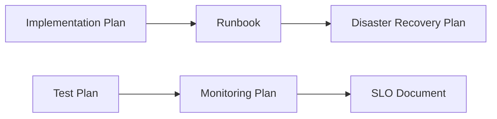

# Operations Phase

The Operations phase ensures production readiness through deployment procedures, monitoring, and reliability engineering.

## Purpose

- Create operational runbooks for deployment and maintenance
- Define monitoring and observability strategies
- Plan disaster recovery and business continuity
- Establish Service Level Objectives and error budgets

## Deliverables

### Runbook (Required)

**Description:** Operational runbook with deployment procedures, troubleshooting guides, and maintenance tasks.

**Inputs:**
- Implementation Plan for deployment context
- Architecture Specification for infrastructure details
- Infrastructure as Code templates
- On-call procedures and escalation paths

**Outputs:**
- Runbook (Markdown)
- Pre/post deployment checklist
- Troubleshooting decision tree

**Evaluation Criteria:**

| Category | Weight | Pass | Partial | Fail |
|----------|--------|------|---------|------|
| Completeness | 30% | All operational scenarios covered with step-by-step procedures | Most scenarios covered | Major scenarios missing |
| Clarity | 25% | Procedures are unambiguous and can be followed by on-call engineer | Some procedures unclear | Procedures require tribal knowledge |
| Actionability | 25% | Each procedure has clear success criteria and verification steps | Some procedures lack verification | Procedures have no validation |
| Rollback Procedures | 20% | Rollback procedures for every deployment step | Partial rollback coverage | No rollback procedures |

### Monitoring Plan (Required)

**Description:** Monitoring and observability plan with metrics, alerts, and dashboards.

**Inputs:**
- Test Plan for quality metrics context
- Architecture Specification for component metrics
- Available monitoring tools (Prometheus, Datadog, etc.)
- Business KPIs to track

**Outputs:**
- Monitoring Plan (Markdown)
- Prometheus/OpenTelemetry metric definitions
- Alerting rules configuration
- Grafana/dashboard specifications

**Evaluation Criteria:**

| Category | Weight | Pass | Partial | Fail |
|----------|--------|------|---------|------|
| Coverage | 30% | All critical paths and components have metrics | Most components covered | Major gaps in coverage |
| Alert Quality | 25% | Alerts are actionable with clear thresholds and runbook links | Some alerts unclear | Alerts are noisy or missing |
| Dashboard Design | 25% | Dashboards support incident triage and trend analysis | Basic dashboards | No dashboard plan |
| Integration | 20% | Monitoring integrates with alerting and on-call systems | Partial integration | No integration plan |

### Disaster Recovery Plan (Optional)

**Description:** Disaster recovery plan with RTO/RPO targets, backup strategies, and failover procedures.

**Inputs:**
- Runbook for operational context
- Architecture Specification for infrastructure topology
- Infrastructure as Code templates
- Business continuity and availability requirements

**Outputs:**
- Disaster Recovery Plan (Markdown)
- Backup configuration and schedules
- Failover and recovery playbook

**Evaluation Criteria:**

| Category | Weight | Pass | Partial | Fail |
|----------|--------|------|---------|------|
| RTO/RPO | 30% | RTO/RPO targets defined and validated against business requirements | Targets defined but not validated | No RTO/RPO targets |
| Backup Strategy | 25% | Backup procedures documented with retention policies and verification | Basic backup plan | No backup strategy |
| Failover Procedures | 25% | Automated or documented manual failover for all critical components | Partial failover coverage | No failover procedures |
| Testing | 20% | DR testing schedule with success criteria | Basic testing plan | No DR testing |

### SLO Document (Required)

**Description:** Service Level Objectives with SLIs, SLOs, error budgets, and reporting.

**Inputs:**
- Monitoring Plan for metrics foundation
- Requirements Specification for non-functional requirements
- Available metrics for SLI calculation
- Business SLA commitments

**Outputs:**
- SLO Document (Markdown)
- SLI calculation formulas and data sources
- Error budget policies and alerting
- SLO dashboard configuration

**Evaluation Criteria:**

| Category | Weight | Pass | Partial | Fail |
|----------|--------|------|---------|------|
| SLI Definition | 25% | SLIs clearly defined with measurement method, data source, and calculation formula | SLIs defined but measurement approach unclear | SLIs not defined |
| SLO Targets | 25% | SLO targets defined with specific percentages, time windows, and business rationale | SLO targets exist but lack rationale or specificity | SLO targets not defined |
| Error Budgets | 20% | Error budgets defined with burn rate alerts, exhaustion policies, and reset procedures | Error budgets mentioned but policies incomplete | Error budgets not defined |
| Stakeholder Alignment | 15% | Stakeholder sign-off documented with escalation procedures and review cadence | Some stakeholder info present | Stakeholder alignment not documented |
| Reporting | 15% | Reporting cadence, dashboard links, and review meeting schedule defined | Basic reporting mentioned | SLO reporting not addressed |

## Phase Gate

### Operations Review

**Type:** Human review and approval

**Reviewers:** SRE Lead, Operations Team, Product Owner, Security Team

**Criteria:**
- All required deliverables complete
- Runbooks tested by operations team
- Monitoring covers all critical paths
- SLOs aligned with business requirements
- DR plan tested or scheduled for testing

**Outcome:**
- **Approved:** Ready for production deployment
- **Revision Required:** Address feedback and resubmit
- **Rejected:** System not production-ready

## Dependencies

## Estimated Effort

| Document | Input Tokens | Output Tokens | Est. Cost |
|----------|--------------|---------------|-----------|
| Runbook | 12,000 | 10,000 | $0.19 |
| Monitoring Plan | 10,000 | 8,000 | $0.15 |
| Disaster Recovery Plan | 10,000 | 8,000 | $0.15 |
| SLO Document | 8,000 | 6,000 | $0.11 |
| **Phase Total** | **40,000** | **32,000** | **$0.60** |

## Best Practices

1. **Test runbooks in staging** - Have on-call engineers execute procedures before production
2. **Start with 4 golden signals** - Latency, traffic, errors, saturation cover most scenarios
3. **Avoid alert fatigue** - Every alert should be actionable; tune thresholds based on data
4. **Practice DR regularly** - Schedule quarterly DR drills; document lessons learned
5. **Set realistic SLOs** - Start conservative; tighten after establishing baselines
6. **Link SLOs to business outcomes** - Each SLO should map to user experience or business metric
7. **Automate error budget tracking** - Integrate with deployment pipelines to gate releases
8. **Document on-call handoffs** - Include current issues, recent changes, and known risks

## SRE Integration

AIDLC Operations phase artifacts integrate with standard SRE practices:

| AIDLC Artifact | SRE Practice | Integration Point |
|----------------|--------------|-------------------|
| Runbook | Incident Response | On-call playbooks |
| Monitoring Plan | Observability | Metric definitions, dashboards |
| DR Plan | Reliability | Chaos engineering, game days |
| SLO Document | Service Level Management | Error budgets, release gates |

## Production Readiness Checklist

Before completing Operations phase, verify:

- [ ] Runbook procedures validated by operations team
- [ ] All critical alerts have runbook links
- [ ] Dashboards support incident triage
- [ ] Backup/restore tested and documented
- [ ] Failover tested (or scheduled)
- [ ] SLOs agreed upon by stakeholders
- [ ] Error budget alerting configured
- [ ] On-call rotation established
- [ ] Escalation paths documented
- [ ] Post-incident review process defined
